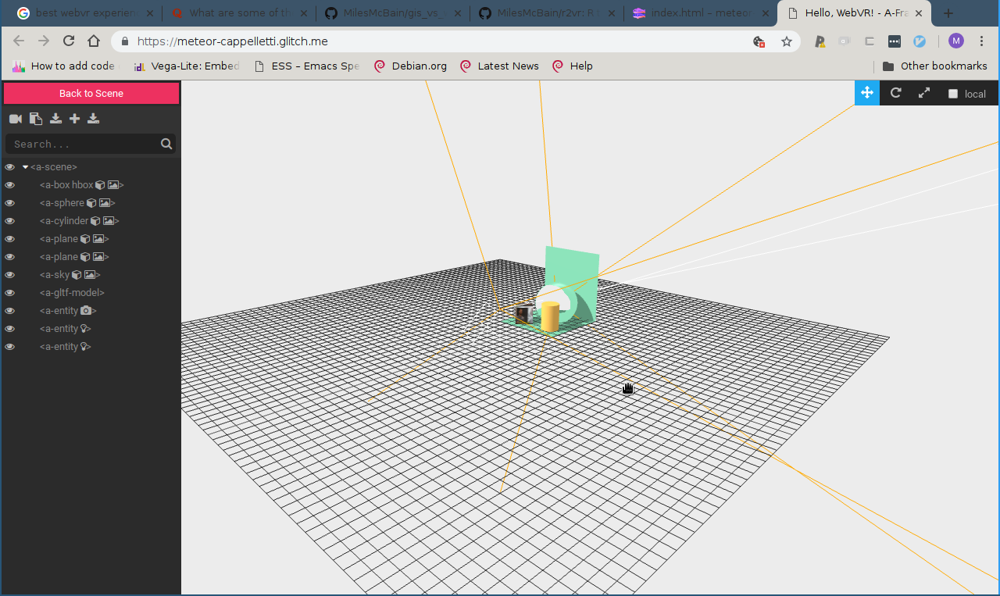

# Developing with A-Frame

## Questions

* How do I make scenes interactive?
* How do I find and use third party components and assets?
* How do I debug A-Frame Scenes?
* How can I move scenes off glitch?

## Overview

* Teaching: X minutes
* Exercises: X minutes

## A-Frame Dev Tools

Now that we have the most of the basic concepts down it's worth discussing
practical aspects of developing with A-Frame. This will assist with tackling
more ambitious examples. This applies to scenes built in R as well as natively.

We'll use this glitch project to demonstrate:

https://glitch.com/edit/#!/meteor-cappelletti

### Browser Dev Tools

The code looks similar to the first example we saw, with the notable addition
of a duck 'gltf-model'. But where is that duck in the scene? Something has gone
wrong.

The first place to check when something unexpected like this happens is the
console in the browser. It can be opened with:

* `Ctrl + Shift + j` in Chrome
* `Ctrl + Shift + k` in Firefox

You're looking in the right place if you can spot messages like these:

```
A-Frame Version: 0.8.0 (Date 2018-03-11, Commit #82934b02)
index.js:86
three Version: github:dmarcos/three.js#r90fixPose
index.js:87
WebVR Polyfill Version: ^0.9.40
```

These are normal messages that confirm WebVR components completed loading.
Warning messages may be present but these are usually safe to ignore. Errors are
usually illuminating. In Chrome, this scene throws this error:

```
/duck:1 Failed to load resource: the server responded with a status of 404 ()
```

'duck' could not be found. Which is strange because the server should be looking
for a 3D model file e.g. 'duck.gltf'.

#### Duck Tales Pt. 1 {.exercise}

Can you spot the mistake that is generating the error? Compare the way the duck
model is loaded to the Hadley gif.

### A-Frame Inspector

We've fixed the error but still no duck. When trying to understand a scene, the
built-in 'A-Frame Inspector' is useful for browsing entities in the scene and
viewing their properties.

While viewing any A-Frame VR scene, Open the A-Frame inspector with `Ctrl + Alt +
i`. It should look similar to this:



The list down the left hand side shows the entities in the scene. Clicking on
them will open an area on the right where their properties can be viewed and
also manipulated. The effect of updating properties will be shown in real time.
This is very useful to discover the perfect settings fiddly things such as
positions, colours, and lighting.

#### Duck Tales Pt. 2 {.exercise}

1. Using the A-Frame inspector, discover where the Duck is in this scene. 
1.Use the information about the duck in the `a-glf-model` to change the Duck's position, scale, and rotation such that it is perched on top of the yellow cylinder.

One new thing you need to know to do this is that the `scale` component is
configured with a vector of scale factors to apply along each axis of the entity
independently.

### Aside: Models and the scaling issue

The duck example was contrived but it reflects a common occurrence when working
with spatial data. As we will see later, the method of importing spatial data
into VR is to generate a 3D mesh from the data, which is loaded as if it were a
regular 3D model (like our duck).

Since spatial data usually have to be projected to a flat surface with units in
meters, they become very large in VR, where meters are roughly equivalent to the
real world.

Using the `scale` component is essential to making the data viewable.

## Common Patterns

This section describes common patterns that are useful to know when constructing scenes.

### Nesting entities

Managing all the properties of all the components of all the entities in a
dynamic scene could easily become laborious if each had to be treated
individually. A-Frame's answer to this is to allow nested entities to inherit
configuration from their parents.

To use the duck and yellow cylinder as an example, a nested configuration looks like this:

```html     
<a-cylinder position="1 0.75 -3" radius="0.5" height="1.5" color="#FFC65D" shadow>
  <a-gltf-model src="#duck" position="0 0.5 0" rotation="0 -100 0"
                scale="1 1 1"></a-gltf-modell>
</a-cylinder>
```

The duck model entity is nested within the closing `</a-cylinder>` tag of the
cylinder entity. Notice the duck's position is now relative to that of the
cylinder. If you preview this configuration you will also notice the duck has
inherited the shadow attribute from the cylinder and now casts a shadow onto it.

Changing the position, rotating, or scaling the cylinder will also affect the
duck. the duck's own properties are applied relative to that of the cylinder

#### Camera Rig {.exercise}

A common application of the nesting pattern is the creation of a camera rig with
a custom controls and a cursor. This depends on a controls component from a popular library of components called [A-Frame Extras](https://github.com/donmccurdy/aframe-extras)

This library has already been loaded in the header. Your task is to:

1. Take the 'Basic movement example' from [A-Frame Extras Movement Controls](https://github.com/donmccurdy/aframe-extras/tree/master/src/controls) and embed it in your scene.
1. Within the entity that define the camera, nest an `a-cursor` entity.
  - If you're successful you should see a small black circle in the centre of your view in the scene. More than just aesthetics, the cursor is useful for driving interactivity.
  
  
### Interactivity

Interactivity in A-Frame borrows again from the web page model. A-Frame has an event system, which allows components to register handlers for certain types of events. Components may also emit events 'on' other entities. An example might make this clear:

The `cursor` component can emit events 'on' entities that:

* It has just started pointing at (`mouseover`)
* It has just stopped pointing at (`mouseleave`)
* It was pointing at while a button was pressed (`click`)
* It has been pointing at for a set amount of time (`click`)
  - This is called 'fusing'

This list is not exhaustive but it gives you an idea. An entity that receives
one of these events can execute code in response to it if it has a defined
handler for an event of that name. Handlers can be attached with components.

There is one useful 3rd party component who's sole purpose is to make it easy to
register handlers for events: The
[event-set](https://github.com/ngokevin/kframe/tree/master/components/event-set)
component. We'll use this in an example of the interactivity system:

To the Hadley-box, we add the component:

```
event-set__mouseenter="material.shader: gif"
```

To the duck, we add the components:

```
event-set__mouseenter="spin.speed: 3.14"
event-set__mouseleave="spin.speed: 0"
```

So now when we look at Hadley, he will start typing, and we look at the duck, it
will rotate.

What has happened is that the events mouse enter and leave events emitted by
`cursor` have had handlers added for them by `event-set` that change the value
of component properties, changing the entity behaviour.

There is a bit a of a blip when the Hadley animation starts and this is due to
us starting the animation in a rough way by changing the entity's shader,
requiring it to be redrawn. A small amount of JS could have made this transition
smooth, but it is outside the scope of this introduction.

## Finally

### Working with A-Frame outside of Glitch

If you try to copy a glitch project down to your local machine and open the
index.html file in a browser, it will not work properly. This is because the JS
files and assets need to be served using the appropriate protocol or your
browser will deem them a security risk and block them.

That is to say the scene needs to be served by a web server. There are numerous
[tools to do this available](https://github.com/milesmcbain/servethis). But if
you create A-Frame via R, this is handled for you.

### Finding Community Components

In the examples we have used a number of community components, imported via
`script` tags in the header. There are two good places to find community components:

* [The A-Frame Registry](https://aframe.io/aframe-registry/)
* [Searching for A-Frame in the Node Package Manager (npm)](https://www.npmjs.com/search?q=aframe)

Components will usually provide an example that shows url to use to import them.

## Summary

* A-Frame inspector
* Chrome devtools
* nested entities
* interactivity
* serving your scene
* Community components
